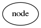
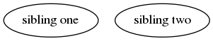
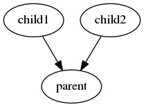
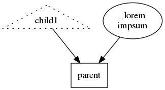
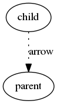
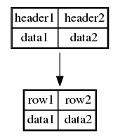
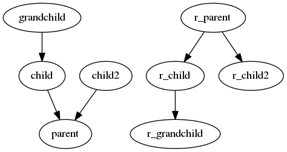

# Installation
You can install it from this repository

    pip install git+git://github.com/c6401/minigraph.git

# introduction
Minigraph is a small convenient language to draw simple graphs based on Yaml sintax, idea of yaml graph represintation of graphs, and Graphwiz awesome drawing abilities. For now it is actually in alpha state, so for example it not fully support csv tables or the sintax can be slightly changed though I'm reluctant to actually do it.

The main idea of this language - every node is represented by yaml dictionary key:

    node:

So let's try it. Micrograph document has a number of sections, but now we are interested in the most important - 'graph' section. Every graph should be placed in that section (or, actually, also in 'reverse graph' section).
So let's try drawing our first node:


```yaml
graph:
  node:
```





Let's try to draw two sibling nodes and then a couple of child nodes with parent node:


```yaml
graph:
  sibling one: null  # as you know you can omit this explicit null
  sibling two:
```





```yaml
graph:
  parent:
    child1:
    child2:
```





## properties
We can also set some properties and since drawing is based on the dot format it supports peoperties from dot.
Minigraph reserves underscore in the beginning of the node name for properties but if you want to have node text starting with underscore or convenient multiline node sintax text you can use _label property.


```yaml
graph:
  parent:
    _shape: box
    child1:
      _shape: triangle
      _style: dotted
    child2:
      _label: |
        _lorem
        impsum
```





We can also set some arrow (graph edge) properties.


```yaml
graph:
  parent:
    child:
      _edge_label: arrow
      _edge_style: dotted
```





## Drawing tables
Another convenient feature that I use a lot - you can draw table instead of node label using csv section:


```yaml
graph:
  parent:
    child:
csv:
  parent: |
    row1, row2
    data1, data2
  child: |
    header1, header2
    data1, data2
```





## Reverse graph
Since in the beginning I created this DSL to visualize databases, my idea of graph was when a child points to its parent.
But if you feel inconvenient that way you could use reverse graph section:


```yaml
graph:
  parent:
    child: grandchild
    child2:
reverse graph:
  r_parent:
    r_child: r_grandchild
    r_child2:
```



